# Flutter Meditation App UI  

### To try the app download the apk from the [Release Tab](https://github.com/mohammedhashim44/Flutter-Meditation-App-UI/releases/download/1.0.0%2B1/app-release.apk)  
-------------  
  
### Flutter Version Used : 2.5.3 
### Desing Credit : By  [Afsar Hossen](https://www.linkedin.com/in/afsar-shuvo/)  
### Desing Files on Figma : [Meditation app UI](https://www.figma.com/community/file/882888114457713282)  

   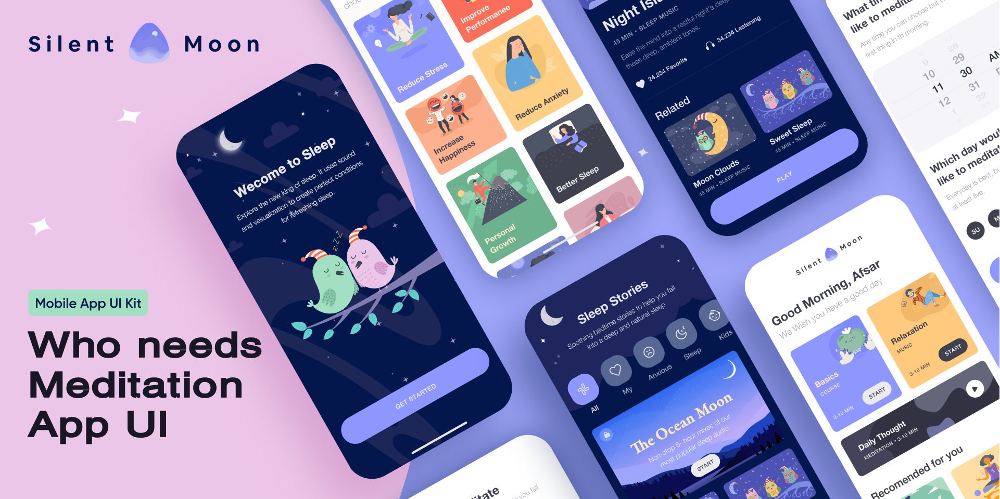

-------------  

## Screenshots  

  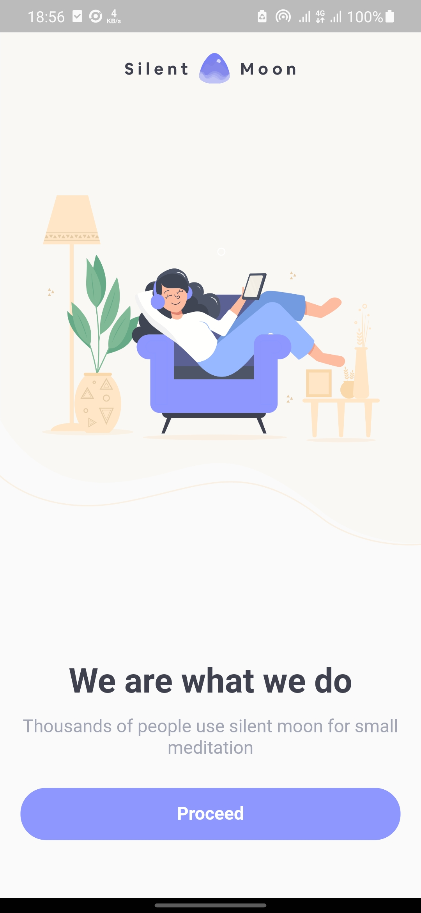
  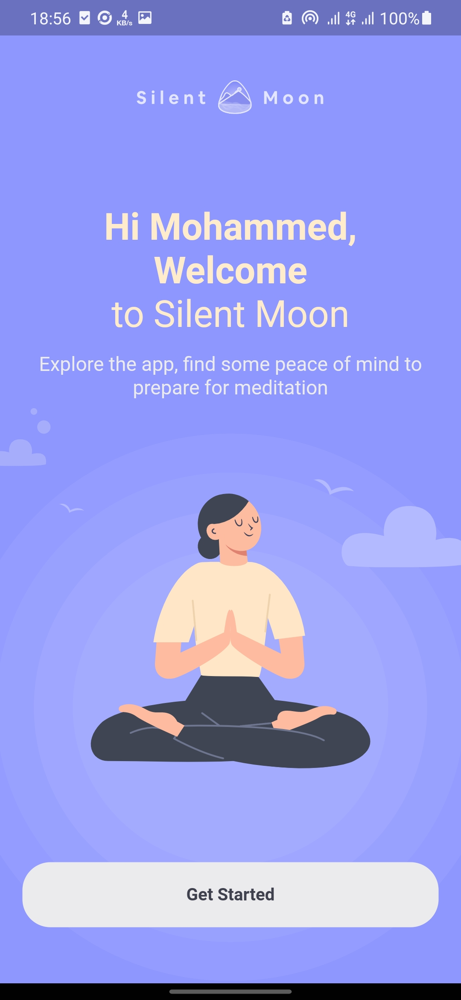
  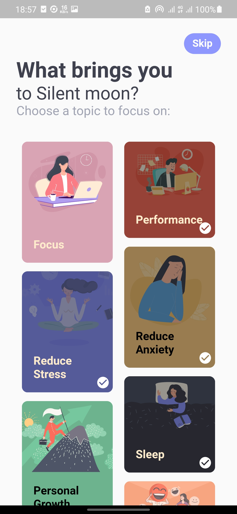
  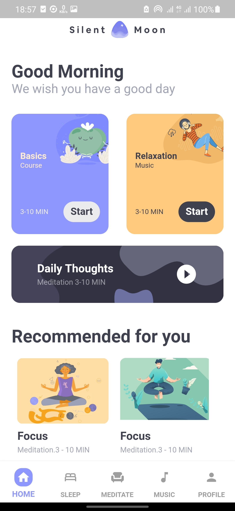
  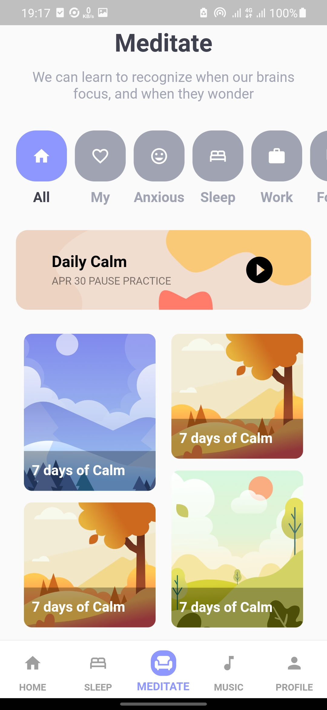
  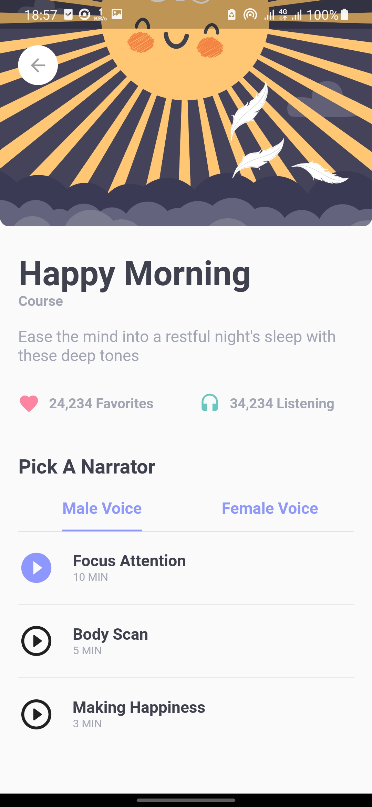
  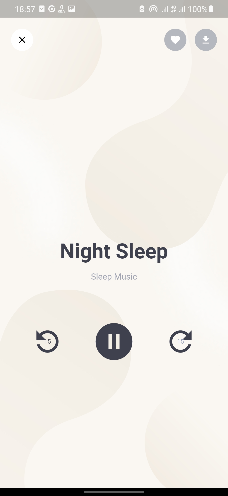
  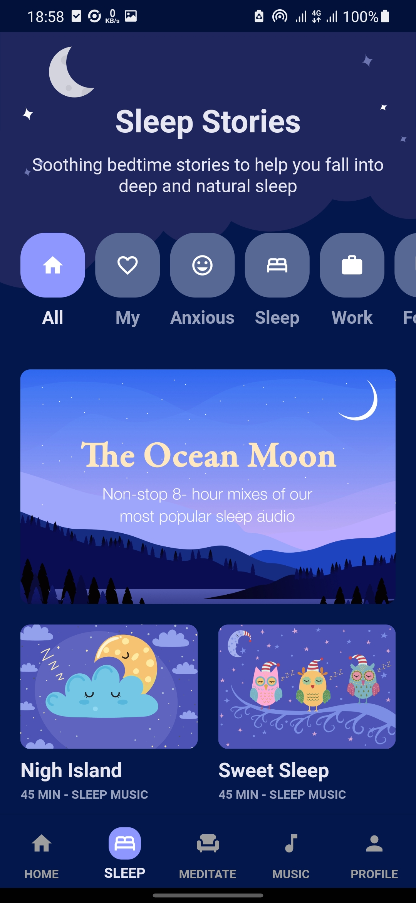
  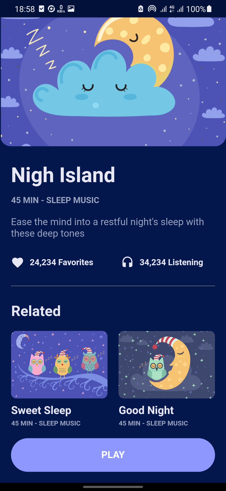
  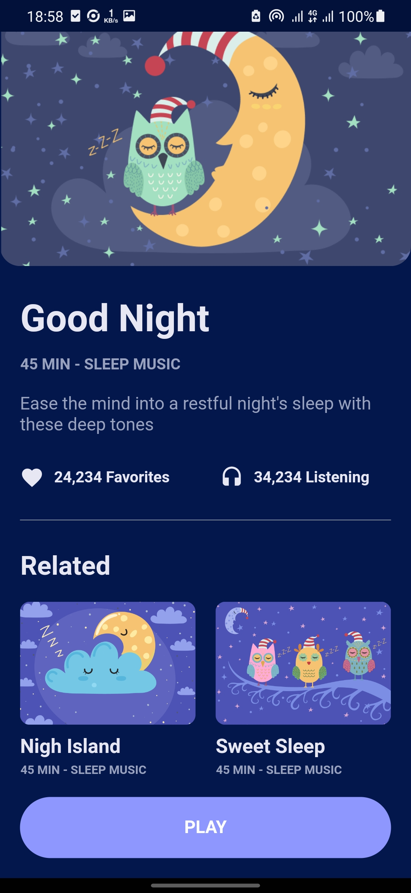
  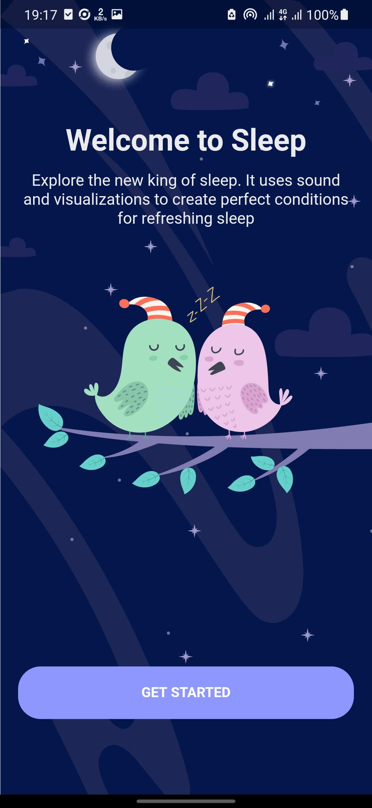
  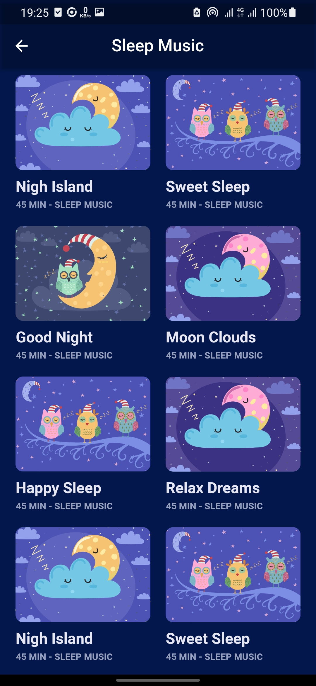
  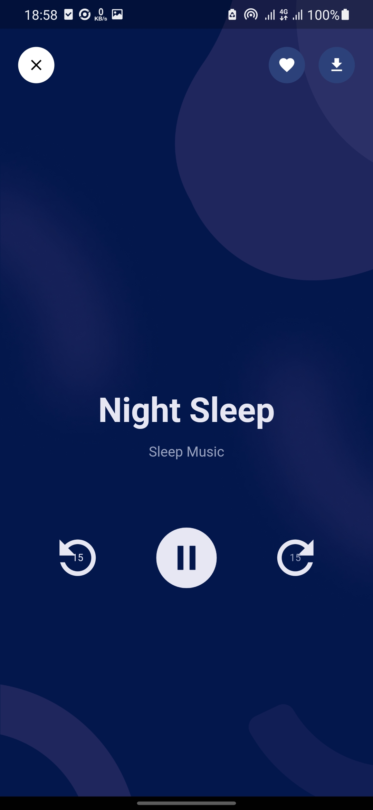

-------------  

## Screens  
- Splash Screen  
- Welcome Screen  
- Choose Topic Screen 
- Home Screen
- Meditate Screen
- Course Details Screen  
- Light Music Player Screen
- Dark Music Player Screen
- Welcome to Sleep Screen
- Sleep Screen 
- Sleep Music Details Screen
- Sleep Music List Screen
